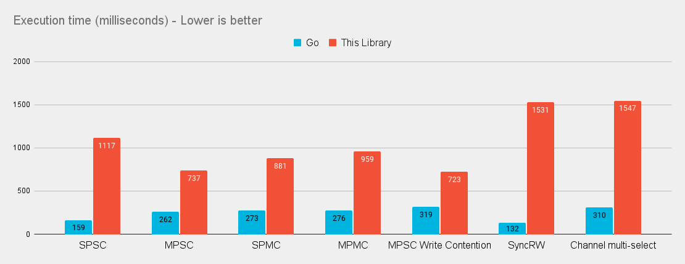

# Async Channels

Performant channels for Swift concurrency.


> Don't communicate by sharing memory; share memory by communicating
> 
> \- Rob Pike

If you are familiar with golang and the go ecosystem, you can skip to the [go comparisons section.](/GolangVsSwift.md)

Channels are a typed conduit through which you can send and receive values - usually across threads or in this case, Swift async tasks. This library is modeled after go's channel behaviors. 

## Example

```swift
let msg = Channel<String>(capacity: 3)
let done = Channel<Bool>()

await msg <- "Swift"
await msg <- "❤️"
await msg <- "Channels"
msg.close()

Task {
    for await message in msg {
        print(message)
    }
    await done <- true
}
await <-done
```

## Benchmarks

### This library vs equivalent [go code](/Benchmarks/golang/benchmark_test.go)


It's not as fast as go - but it's still pretty fast!

### This Library vs [Apple's Async Algorithms channel implementation](https://github.com/apple/swift-async-algorithms/blob/main/Sources/AsyncAlgorithms/AsyncAlgorithms.docc/Guides/Channel.md)


For more detailed results see the [Benchmarks](/Benchmarks/) readme.

## Usage

1. Add `https://github.com/gh123man/Async-Channels` as a Swift package dependency to your project. 
2. `import AsyncChannels` and go!

## Channel Operations


Un-Buffered Channels
```swift
// Create an un-buffered channel
let msg = Channel<String>()

Task {
    // Send a value. Send will suspend until the channel is read. 
    await msg <- "foo" 
}

Task {
    // Receive a value. Receive will suspend until a value is ready
    let foo = await <-msg
}
```

Buffered Channels
```swift
// Create a buffered channel that can hold 2 items
let msg = Channel<String>(capacity: 2)

// Writing to a buffered channel will not suspend until the channel is full
await msg <- "foo" 
await msg <- "bar" 

// Messages are received in the order they are sent
print(await <-msg) // foo
print(await <-msg) // bar

// The channel is now empty. 
```

### Closing Channels

A Channel can be closed. In Swift, the channel receive (`<-`) operator returns `T?` because a channel read will return `nil` when the channel is closed. If you try to write to a closed channel, a fatalError will be triggered.

```swift
let a = Channel<String>()
let done = Channel<Bool>()

Task {
    // a will suspend because there is nothing to receive
    await <-a 
    await done <- true
}

// Close will send `nil` causing a to resume in the task above
a.close() 
// done is signaled 
await <-done
```

### Sequence operations 

`Channel` implements `AsyncSequence` so you may write:
```swift
let a = Channel<String>() 

for await message in a {
    print(message)
}
```

The loop will break when the channel is closed. 

## Select

`select` lets a single task wait on multiple channel operations. `select` will suspend until at least one of the cases is ready. If multiple cases are ready it will choose one randomly. 

### Operations

`rx(c)` receive a value, but do nothing with it. 

`rx(c) { v in ... }` receive a value and do something with it. 

`tx(c, "foo")` send a value and do nothing.

`tx(c, "foo") { ... }` run some code if a send is successful. 

`none { ... }` if none of the channel operations were ready, none will execute instead. 

### Examples

```swift

let c = Channel<String>()
let d = Channel<String>()

Task {
    await c <- "foo"
    await d <- "bar"
}

// Will print foo or bar
await select {
    rx(d) { print($0!) }
    rx(c) { print($0!) }
}
```

```swift 
let a = Channel<String>(capacity: 10)
let b = Channel<String>(capacity: 10)

// Fill up a
for _ in (0..<10) {
    await a <- "a"
}

for _ in (0..<20) {
    await select {
        // receive from a and print it
        rx(a) { print($0!) }
        // send "b" to b
        tx(b, "b")
        // if both a and b suspend, print "NONE"
        none {
            print("NONE")
        }
    }
}
```

## Notes

If you are looking for a blocking variant of this library for traditional swift concurrency, check out my previous project [Swigo](https://github.com/gh123man/Swigo) which this library is based off of. 


# Special Thanks

I could not have gotten this far on my own without the help from the folks over at [forums.swift.org](https://forums.swift.org/t/async-channels-for-swift-concurrency/70752). Big shout-out and thank you to:
- [wadetregaskis](https://forums.swift.org/u/wadetregaskis/summary) for optimizing much of this code and finding the more challenging performance limitations (compiler limitations, locking strategies)
- [vns](https://forums.swift.org/u/vns/summary) for proposing a `LinkedList` backing data structure
