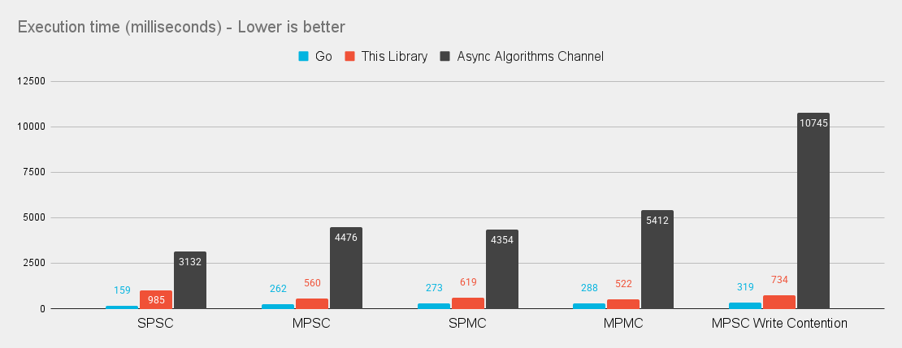
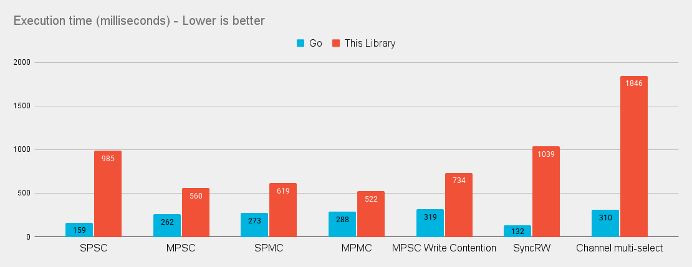

# Async Channels

Performant MPMC (**M**ulti **P**roducer **M**ulti **C**onsumer) channels for swift concurrency. 

Channels are a typed conduit through which you can send and receive values - usually across threads or in this case, Swift async tasks. This library is modeled after go's channel behaviors. 

This library provides an async channel implementation with useful features such as: `select`, sequence operations, blocking/non-blocking operations, and more. 


If you are familiar with golang and the go ecosystem, you can skip to the [go comparisons section.](/GolangVsSwift.md)

## Example

```swift
let msg = Channel<String>(capacity: 3)
let done = Channel<Bool>()

Task {
    for await message in msg {
        print(message)
    }
    await done <- true
}

await msg <- "Swift"
await msg <- "❤️"
await msg <- "Channels"

msg.close()
await <-done
```

## Benchmarks

### This Library vs go vs [Apple's Async Algorithms channel implementation](https://github.com/apple/swift-async-algorithms/blob/main/Sources/AsyncAlgorithms/AsyncAlgorithms.docc/Guides/Channel.md)


### This library vs equivalent [go code](/Benchmarks/golang/benchmark_test.go)


Obviously being as fast as go is a lofty goal that we may never reach, but it's still pretty fast!

*The above results were sampled from the `Int` tests in the detailed benchmark results*

For more detailed results (on a variety of data types) see the [Benchmarks](/Benchmarks/) readme.

## Usage

1. Add `https://github.com/gh123man/Async-Channels` as a Swift package dependency to your project. 
2. `import AsyncChannels` and go!

## Channel Operations


### Un-Buffered Channels
```swift
// Create an un-buffered channel
let msg = Channel<String>()

Task {
    // Send a value. Send will suspend until the channel is read. 
    await msg <- "foo" 
}

Task {
    // Receive a value. Receive will suspend until a value is ready
    let foo = await <-msg
}
```

### Buffered Channels
```swift
// Create a buffered channel that can hold 2 items
let msg = Channel<String>(capacity: 2)

// Writing to a buffered channel will not suspend until the channel is full
await msg <- "foo" 
await msg <- "bar" 

// Messages are received in the order they are sent
print(await <-msg) // foo
print(await <-msg) // bar

// The msg channel is now empty. 
```

### Closing Channels

A Channel can be closed. In Swift, the channel receive (`<-`) operator returns `T?` because a channel read will return `nil` when the channel is closed. If you try to write to a closed channel, a fatalError will be triggered.

```swift
let a = Channel<String>()
let done = Channel<Bool>()

Task {
    // a will suspend because there is nothing to receive
    await <-a 
    await done <- true
}

// Close will send `nil` causing a to resume in the task above
a.close() 
// done is signaled 
await <-done
```

### Sequence operations 

`Channel` implements `AsyncSequence` so you may write:
```swift
let a = Channel<String>() 

for await message in a {
    print(message)
}
```

The loop will break when the channel is closed. 

## Select

`select` lets a single task wait on multiple channel operations. `select` will suspend until at least one of the cases is ready. If multiple cases are ready it will choose one randomly. 

### Operations

`receive(c)` receive a value, but do nothing with it. 

`receive(c) { v in ... }` receive a value and do something with it. 

`send("foo", to: c)` send a value and do nothing.

`send("foo", to: c) { ... }` run some code if a send is successful. 

`none { ... }` if none of the channel operations were ready, none will execute instead. 

`any(x1, x2, ...) { x in ... }` or `any(seq) { el in ... }` operates on a sequence and is useful for performing the same operations on multiple channels.

### Examples

```swift

let c = Channel<String>()
let d = Channel<String>()

Task {
    await c <- "foo"
    await d <- "bar"
}

// Will print foo or bar
await select {
    receive(d) { print($0!) }
    receive(c) { print($0!) }
}
```

```swift 
let a = Channel<String>(capacity: 10)
let b = Channel<String>(capacity: 10)

// Fill up channel a
for _ in (0..<10) {
    await a <- "a"
}

for _ in (0..<20) {
    await select {
        // receive from a and print it
        receive(a) { print($0!) }
        // send "b" to b
        send("b", to: b)
        // if both a and b suspend, print "NONE"
        none {
            print("NONE")
        }
    }
}
```

## Synchronizing async and non-async code

In some cases it may be desirable to synchronize async functions with non async swift code. Usually you can do this with a `DispatchSemaphore` or similar synchronization primitive, however this library provides [useful extensions](https://github.com/gh123man/Async-Channels/blob/main/Sources/AsyncChannels/Channel%2BExtensions.swift#L17-L42) to make this process simpler:

```swift 
let resultChannel = Channel<Void>()

Task {
    // Do some async work
    let result = await doLongAsyncWork()
    await resultChannel <- result
}

// Block the current thread until the work is done, receiving the result
let result = resultChannel.blockingReceive()
```

You may also do the opposite and block while sending:

```swift 
let dataChannel = Channel<String>()

Task {
    // doLongAsyncWork will eventually read the channel
    await doLongAsyncWork(dataChannel)
}

// Block the current thread until the async task reads the channel
let result = resultChannel.blockingSend("Hello world")
```

You an also synchronously poll a channel if it is ready or not without blocking using `syncReceive`. Similarly you can use `syncSend` to send a value synchronously without blocking. Note that in both cases, if the channel is full it will discard the sent value or return `nil` on receive. 

## Advanced Usage
This library also includes some extra features that are made possible by the flexibility of Swift's `resultBuilder`. 

### Examples

#### Multiplexing `n:1` channels using select `any`
```swift
let channels = (0..<100).map { _ in Channel<Bool>() }
let collected = Channel<Bool>()

// 100 tasks writing to 100 channels
for c in channels {
    Task {
        await c <- true
    }
}

// 1 task recieving from 100 channels and writing the results to 1 channel. 
Task {
    for _ in 0..<100 {
        await select {
            any(channels) { channel in
                receive(channel) { val in
                    await collected <- val!
                }
            }
        }
    }
    collected.close()
}

var sum = 0
for await _ in collected {
    sum += 1
}
```

#### Conditional cases
```swift 
let a = Channel<String>()
let b = Channel<String>()

Task {
    await a <- "foo"
}

var enableReceive = true
await select {
    if enableReceive {
        receive(a) { await result <- $0! }
    }
    send("b", to: b)
}
```


## Code Samples

See the [Examples](/Examples/) folder for real world usage. 

- [Parallel image converter](/Examples/ImageConverter/Sources/ImageConverter/main.swift) - Saturate the CPU to convert images applying back pressure to the input. 


# Special Thanks

I could not have gotten this far without the help from the folks over at [forums.swift.org](https://forums.swift.org/t/async-channels-for-swift-concurrency/70752) and contributors on github. Big shout-out and thank you to:
- [wadetregaskis](https://forums.swift.org/u/wadetregaskis/summary) for optimizing much of this code and finding the more challenging performance limitations (compiler limitations, locking strategies)
- [vns](https://forums.swift.org/u/vns/summary) for proposing a `LinkedList` backing data structure
- [Kuniwak](https://github.com/Kuniwak) for proposing and adding the select `any` function.
